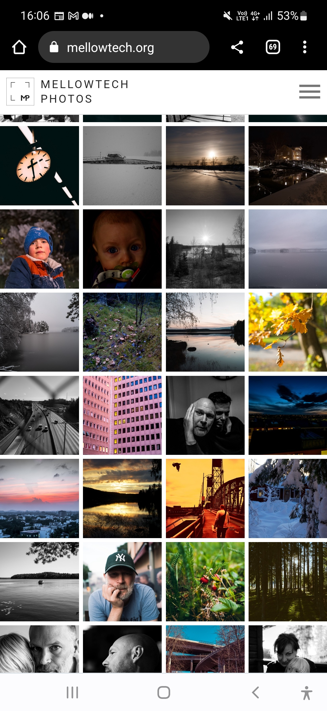
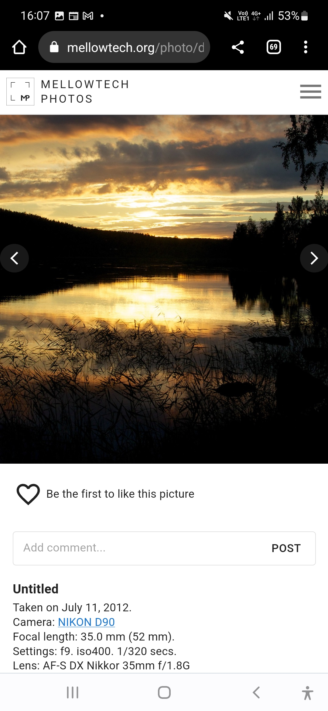

# About

This project is the frontend for [mphotos](https://www.github.com/msvens/mphotos).

It is my personal [photo blog](https://www.mellowtech.org). The focus is to create
a simplified workflow from lightroom to photo blog such that once you export
your edited images to Google Drive they will be automatically picked up by the
photo blog.

# Installation/Running

## Development

- yarn
- yarn dev

## Building

- yarn
- yarn build

## Key Features

### Mobile First
This photo blog is designed to work well on both mobile and desktop.

- Connect to google drive
- Automatic exif parsing and thumbnail creation
- Setting basic user profile information
- Create, delete and edit image information
- Private photos - set photos to only be viewable if you are logged in
- Add photos to albums
- Infinite scrolling of image grid
- Editable Camera Db - images, information, etc
- Mobile aware (swipes, etc)
- Fullscreen mode
- Comments, Likes
- Configurable UI (color theme, image grid settings, etc)

# Thanks

This project was bootstrapped with [Create React App](https://github.com/facebook/create-react-app).

The excellent [material-ui](https://material-ui.com/) serves as the UI framework
